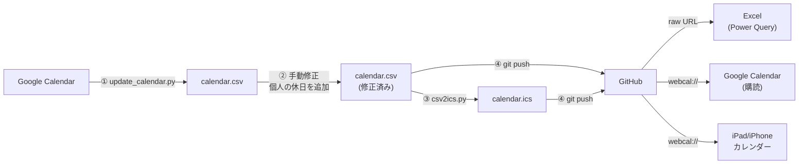

# holiday

祝日・休日データを GitHub で管理し、Excel の Power Query や各種カレンダーアプリから自動取り込みすることで、祝日設定を各種ツール間で同期するためのリポジトリです。

## ファイル構成

| ファイル | 内容 |
|---|---|
| `calendar.csv` | メインファイル。Power Query 等の取り込み先はこのファイルを参照する |
| `calendar.ics` | カレンダーアプリ購読用（`csv2ics.py` で生成） |
| `update_calendar.py` | Google Calendar と `calendar.csv` を同期するスクリプト |
| `csv2ics.py` | `calendar.csv` → `calendar.ics` 変換スクリプト |
| `2025.csv` | 移行用。現在は `calendar.csv` と同一内容 |

> **Note**: `2025.csv` は当初、年度ごとにファイルを切り替える運用を想定して作成しましたが、その場合 Power Query のソース URL を毎年変更する必要が生じるためこの方式はやめました。以降は `calendar.csv` を正とし、過去年度分は年度ファイル（例: `2025.csv`）へ切り出して保管することを想定しています。

## CSV フォーマット

```
日付,祝日名
2025-01-01,元日
2025-01-13,成人の日
...
```

| 列 | 形式 | 説明 |
|---|---|---|
| 日付 | YYYY-MM-DD | 休日の日付 |
| 祝日名 | 文字列 | 祝日・休日の名称（日本語） |

### 祝日名の種別

| 値 | 区分 | 説明 |
|---|---|---|
| 元日、成人の日 など | 法定祝日 | Google Calendar から同期 |
| 天皇誕生日 振替休日 など | 振替休日 | Google Calendar から同期 |
| `大晦日` | 年末 | Google Calendar から同期 |
| `休日` | 個人の独自休日 | 手動管理。同期対象外 |

## 更新手順

すべてのスクリプトは標準ライブラリのみで動作します（追加インストール不要）。

### 更新フロー



### ① Google Calendar と同期

```bash
python3 update_calendar.py
```

- Google Calendar の日本祝日カレンダーから最新データを取得
- `calendar.csv` の最小日付以降のデータが対象
- 祝日名が `休日` のエントリは個人の独自休日として**同期対象外**
- 追加・名称変更・Google Calendar に存在しないエントリを表示してから更新

### ② 個人の休日を追記

`calendar.csv` に個人の休日を追記(手動)

### ③ ICS ファイルを再生成

```bash
python3 csv2ics.py
```

### ④ コミット・プッシュ

```bash
git add calendar.csv calendar.ics
git commit -m "Update YYYY"
git push
```

## Power Query での取り込み方法

Excel の Power Query で以下の URL を指定することで、CSV を直接インポートできます。

```
https://raw.githubusercontent.com/jca02266/holiday/main/calendar.csv
```

## カレンダーアプリへの登録

### Google Calendar

以下のリンクをクリックすると、Google Calendar の「URL で追加」画面が開きます。

[Google Calendar に追加する](https://calendar.google.com/calendar/render?cid=webcal%3A%2F%2Fraw.githubusercontent.com%2Fjca02266%2Fholiday%2Fmain%2Fcalendar.ics)

> **Note**: Google Calendar の購読カレンダーは自動更新されますが、反映まで最大 24 時間かかる場合があります。

### iPad / iPhone の標準カレンダー

Safari で以下の URL を開くと「カレンダーを登録しますか？」ダイアログが表示されます。

```
webcal://raw.githubusercontent.com/jca02266/holiday/main/calendar.ics
```
